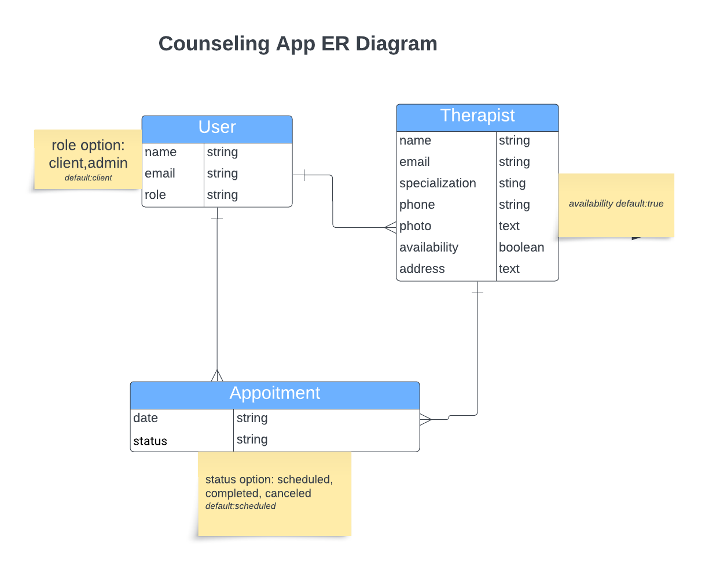
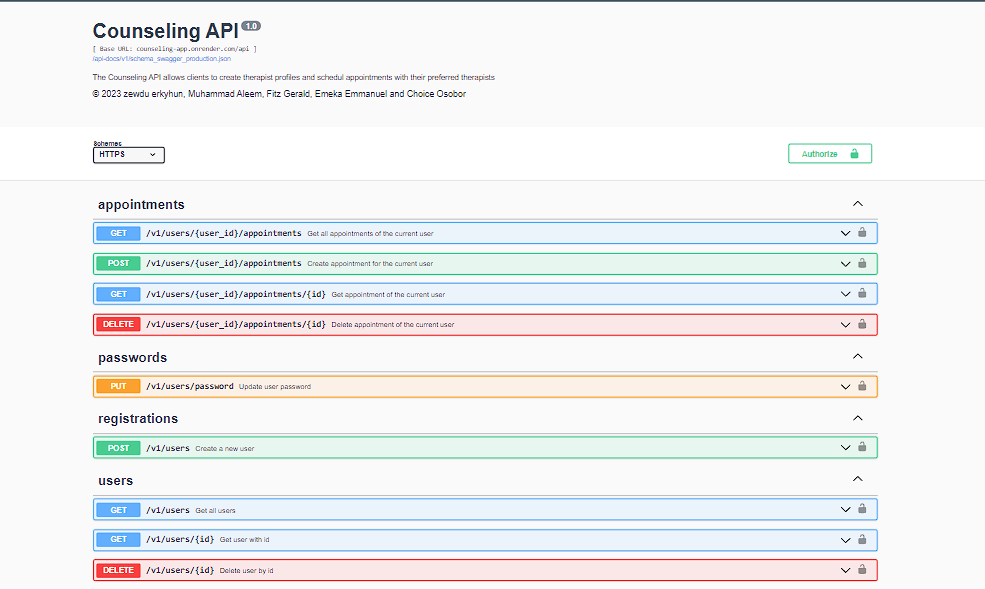

<a name="readme-top"></a>

# 📗 Table of Contents

- [📖 About the Project](#about-project)
  - [:camera: screenshots](#screenshots)
  - [🛠 Built With](#built-with)
    - [Tech Stack](#tech-stack)
    - [Key Features](#key-features)
    - [🚀 Live Demo](#live-demo)
- [💻 Getting Started](#getting-started)
  - [Setup](#setup)
  - [Prerequisites](#prerequisites)
  - [Usage](#usage)
- [👥 Authors](#authors)
- [🔭 Future Features](#future-features)
- [🤝 Contributing](#contributing)
- [⭐️ Show your support](#support)
- [🙏 Acknowledgements](#acknowledgements)

- [📝 License](#license)

# 🏥 Counseling  API <a name="about-project"></a>

> The Counseling API allows clients to create therapist profiles and schedule appointments with their preferred therapists.

### Frontend Repository
  <a href="https://github.com/MAleemH/final-capstone-front-end">Final capstone front end</a>

## :camera: screenshots <a name="screenshots"></a>

  
  


## 🛠 Built With <a name="built-with"></a>

### Tech Stack <a name="tech-stack"></a>

- <a href="https://www.ruby-lang.org/es/">ROR</a>
- <a href="https://www.postgresql.org/">Postgresql</a>
- <a href="https://rspec.info/">Rspec</a>

### :rocket: Live Demo <a name="live-demo"></a>

  - <a href="https://counseling-app.onrender.com/api-docs/index.html">Live Link</a>

### Key Features <a name="key-features"></a>

- [x] Create user based on role
- [x] Create therapist profile and view all therapists
- [x] Create appointment and view all appointments
- [x] Authentication  using JWT
- [x] Authorization using cancan
- [x] Unit testing using rspec

<p align="right">(<a href="#readme-top">back to top</a>)</p>

## 💻 Getting Started <a name="getting-started"></a>

To get a local copy up and running, follow these steps.

### Prerequisites

In order to run this project you need:

- Command line or terminal
- IDE such as VsCode.
- Rails needs to be installed on your system.

### Setup

Clone this repository to your desired folder:
Example command:

```sh
  git clone https://github.com/MAleemH/final-capstone-back-end.git
  cd final-capstone-back-end

```

### Install

Example command:

```sh
  cd final-capstone-back-end
  bundle install (install all dependencies)

```

### Usage

To run the project redirecting to the root directory of the project and run the following command:

```sh
 bin/rails server (to run web API)

```

### Test

To test the web app run the following command:

```sh
 rspec spec ( to test the web API)

```

## 👥 Authors <a name="authors"></a>

👤 **Zewdu Erkyhun**

- GitHub: [@zewdu444](https://github.com/zewdu444)
- Twitter: [@zewdu444](https://twitter.com/zewdu444)
- LinkedIn: [zewdu-anley](https://www.linkedin.com/in/zewdu-anley/)

👤 **Emeka Emmanuel Ugboaja**

- GitHub: [EmekaEmmanuel](https://github.com/EmekaEmmanuel)
- Twitter: [@emekaekeoha](https://twitter.com/emekaekeoha)
- LinkedIn: [emeka-ugboaja](https://www.linkedin.com/in/emeka-ugboaja-167820226)

👤 **Muhammad Aleem**

- GitHub: [@MAleemH](https://github.com/MAleemH)
- Twitter: [@MAleemHashmi1](https://twitter.com/MAleemHashmi1)
- LinkedIn: [LinkedIn](https://www.linkedin.com/in/muhammad-aleem-hashmi/)

👤 **Fitz Gerald**

- GitHub: [@githubhandle](https://github.com/fitz95/)
- Twitter: [@twitterhandke](https://twitter.com/nsonggerald/)
- linkedIn: [@linkedinhandle](https://www.linkedin.com/in/nsong-asoh/)

👤 **Choice Osobor**

- GitHub: [@techemprez](https://github.com/techemprez)
- Twitter: [@techemprez](https://twitter.com/techemprez)
- LinkedIn: [Choice Osobor](https://www.linkedin.com/in/choice-osobor/)


<p align="right">(<a href="#readme-top">back to top</a>)</p>

## 🔭 Future Features <a name="future-features"></a>

- [add comments for therapist and client]


<p align="right">(<a href="#readme-top">back to top</a>)</p>

## 🤝 Contributing <a name="contributing"></a>

Contributions, issues, and feature requests are welcome!

Feel free to check the [issues page](https://github.com/MAleemH/final-capstone-back-end/issues).

<p align="right">(<a href="#readme-top">back to top</a>)</p>

## ⭐️ Show your support <a name="support"></a>

Give a ⭐️ if you like this project!

<p align="right">(<a href="#readme-top">back to top</a>)</p>

## 🙏 Acknowledgments <a name="acknowledgements"></a>

-  We would like to thank microverse community for the support and guidance, Thank you [Murat Korkmaz](https://www.behance.net/muratk)  on Behance for the Awesome Design Template.


<p align="right">(<a href="#readme-top">back to top</a>)</p>

## 📝 License <a name="license"></a>

This project is [MIT](./LICENSE) licensed.

<p align="right">(<a href="#readme-top">back to top</a>)</p>
